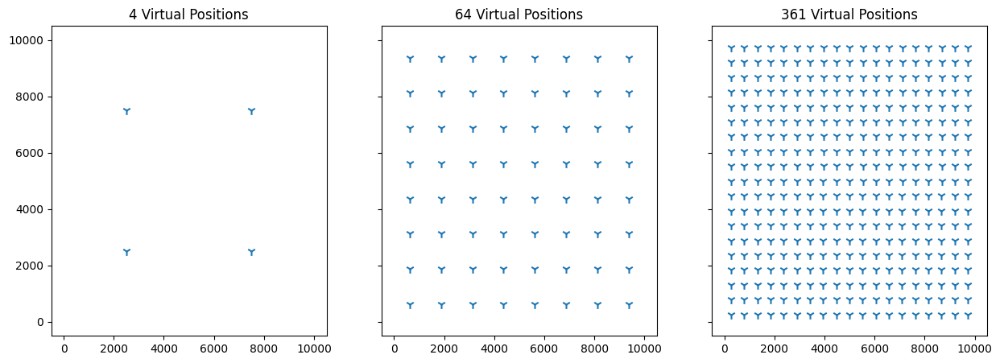
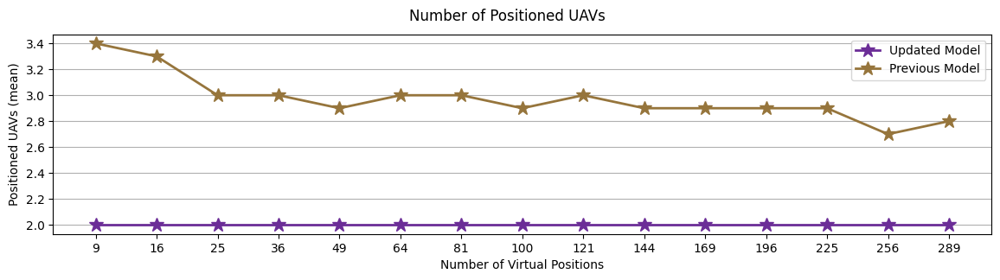
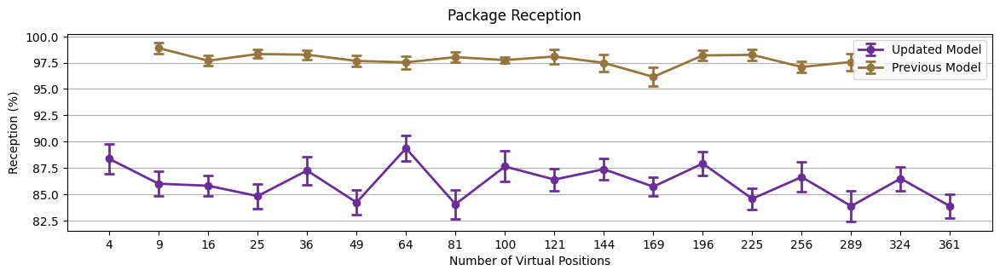
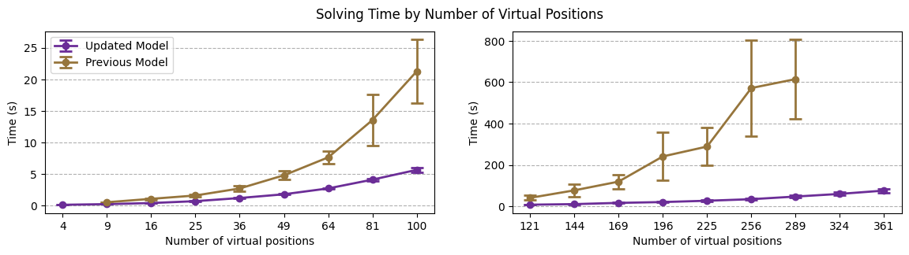
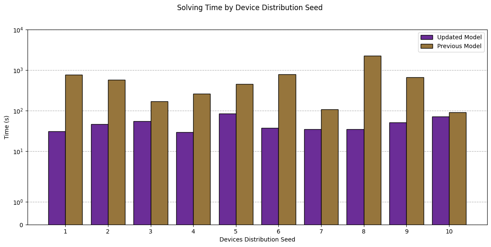

# Optimal Dynamic Positioning of LoRa Gateways Considering Channel Modeling to Assure QoS for IoT Network Slices


<p align='center' style="margin-bottom: -4px">William T. P. Junior, Daniel C. da Silva</p>
<p align='center' style="margin-bottom: -4px">Instituto de Informática, Universidade Federal de Goiás</p>
<p align='center'>E-mail: {williamtpjunior, dante_campos}@discente.ufg.br</p>

## Introduction

In wireless communication, the air channel which will propagate the message have a lot less guarantees of how it will work in comparison with wired channels. Between a transmitter and a receptor there may be static objects (e.g. buildings) and dynamic objects (e.g. cars), which will absorb or reflect part of the signal. The Earth surface itself works as a reflector, possibly causing interference, alongside other transmitters that can be signaling simultaneously at the same frequency.

The physical models to determine how a signal is degraded are complex. Because of this, we rely on an approximation called Log-Distance Path Loss (LDPL) [1], a log function that aggregates deterministic and stochastic attenuation to provide the loss of a signal, in decibels, through a distance $d$.


## System Model

This work considers a scenario where LoRa End Devices (LoRa-EDs) are randomly scattered and stationary, and LoRa Gateways (LoRa-GWs) are mounted on UAVs. We also assume that each gateway connects to a 5G BS with unlimited capacity. The main goal, as in [2], is to reduce the number of LoRa-GWs required to satisfy the QoS constraints, however, this time we model the path loss of the signal. To achieve this, we minimize the number of discrete locations assigned to LoRa-GW UAVs, while granting that every LoRa-ED can connect to a LoRa-GW able to receive its signal above the minimum sensitivity.


Let $\mathcal{K} = \{k_1, k_2, \dots, k_{|\mathcal{K}|}\}$ the set of LoRa-EDs connected to LoRa-GWs and belongs to a set of slices $\mathcal{L} = \{l_1, l_2, \dots, l_{|\mathcal{L}|}\}$, the slices are defined based on QoS requirements of IoT applications, and $\mathcal{C} = \{c_1 , c_2, \dots, c_{|\mathcal{C}|}\}$ the configuration set, with possible combinations between Spreading Factor (SF) and Transmission Power (TP) where $\mathcal{C} \subseteq (\mathcal{SF}\times\mathcal{TP})$. We discretize the space where LoRa-GWs deployed in UAVs can be placed in a set $\mathcal{P} = \{p_1=(x_1,y_1,z_1),\; p_2=(x_2,y_2,z_2),\; \dots, \; p_{|\mathcal{P}|}=(x_{|\mathcal{P}|},y_{|\mathcal{P}|},z_{|\mathcal{P}|}) \}$ of points uniformly distributed and equally spaced by a distance $d$ along 3 axes perpendicular to each other.

Finally, we define the objective function as,

```math
\text{minimize} \quad \sum_{p \in \mathcal{P}} \Bigg\lceil \sum_{k\in\mathcal{K}} \sum_{c\in\mathcal{C}} \frac{ x^{p}_{k,c} } {|\mathcal{K}|} \Bigg\rceil
```

where $x^{p}_{k,c} \in \{0,1\}$ is the decision variable that indicates whether an UAV was positioned at point $p \in \mathcal{P}$ to serve the device $k \in \mathcal{K}$ using a configuration $c \in \mathcal{C}$.

To ensure that for each device $k \in \mathcal{K}$ there's exactly one UAV positioned at point $p \in \mathcal{P}$ with an assigned configuration $c \in \mathcal{C}$, we define the following constraint:

```math
\sum_{p \in \mathcal{P}} \sum_{c\in\mathcal{C}}x^{p}_{k,c} = 1, \quad\forall k \in\mathcal{K}
```

To guarantee that the bandwidth $R^{max}_l$ assigned to each Slice $l \in \mathcal{L}$ per LoRa GW at position $p \in \mathcal{P}$ is not exceeded, the sum of uplink traffic $R_k$ for all devices $k \in \mathcal{K}$ connected to that LoRa GW must not surpass $R^{max}_l$.

```math 
\sum_{k\in\mathcal{K}} \sum_{c\in\mathcal{C}} S(k,l) \cdot x^{p}_{k,c} \cdot R_k \le R^{max}_{l}, \quad \forall l \in\mathcal{L}, \forall p\in\mathcal{P}
```

Where $S(k,l)$ is a mapping function over the input data, resulting in $1$ when the device $k \in \mathcal{K}$ is associated with the slice $l \in \mathcal{L}$, and $0$ otherwise.

The lower bound QoS $\rho_l^{QoS}$ defined for each slice $l \in \mathcal{L}$ must be granted to every device $k \in \mathcal{K}$ associated with it.

```math
\sum_{p\in\mathcal{P}}
\sum_{c\in\mathcal{C}}
x^{p}_{k,c} \cdot
S(k,l)\cdot QoS_{c,l}
\ge \rho^{QoS}_l
\,,\quad \forall l\in\mathcal{L}
,\forall k\in\mathcal{K}
```

Lastly, given the signal attenuation of the wireless channel, every device $k \in \mathcal{K}$ must be assigned to a LoRa GW at point $p \in \mathcal{P}$ capable of receiving its signal above the minimum sensibility $S_{rx}(c)$ of the LoRa GW for the configuration $c\in\mathcal{C}$, enabling the communication. To achieve this, we define the following constraint:

```math 
\sum_{p\in\mathcal{P}}
\sum_{k\in\mathcal{K}}
\sum_{c\in\mathcal{C}}
x^{p}_{k,c}
\Big(P_{tx}(c) - PL(p,k)\Big) \ge S_{rx}(c)
```

Where $P_{tx}(c)$ is the transmission power of a LoRa ED using configuration $c\in\mathcal{C}$ and $PL(p, k)$ is the LDPL result, calculated with:

```math 
PL(p, k)[dB] = 10 \cdot n \cdot log_{10}\bigg(\frac{d(p,k)}{d_0}\bigg) + P_{r0}
```

In which $n$ defines the function's slope, $P_{r0}$ is the reference reception power, $d_0$ is the reference distance and $d(p, k)$ is the distance between LoRa ED $k \in \mathcal{K}$ and the LoRa GW positioned at point $p \in \mathcal{P}$.

## Evaluation

Our methodology in evaluating the updated model can be divided in three steps: 

1) Input data generation: The data needed to execute the optimization includes the virtual positions where a LoRa-GW UAV can be placed and the position of the LoRa-EDs and their slice association. For the previous model, we also simulate the LoRa-EDs and LoRa-GWs transmission to generate the data about signal reach.

2) Optimal solution: We then implement the model described previously using Pyomo in order to find an optimal solution through SCIP Optimization Suite, an open source solver for integer programming models. 

3) Solution simulation: Finally, in order to validate the quality of the solution, we simulate it in the Network Simulator 3 (NS3), in order to collect data related to package delivery when subject to an environment with more parameters, e.g. inter LoRa-GW signal interference.

We consider a varying number of virtual positions, as depicted in Fig. 1, equally distributed over the space at the same height level. For the LoRa-EDs, we consider 30 devices positioned in a pseudo randomly way given ten different seeds and equally distributed between three slices.

<p align='center'>
    
    <figurecaption>
    Fig. 1. Example of virtual positions.
    </figurecaption>
</p>

For the QoS lower bound, we consider $\rho_l^{QoS} = 0.9$, and regarding the path loss parameters, the same values applied to NS3 simulation are used, $d_0 = 1$, $n = 3.76$ and $P_{r0} = 10$. 

After generating the input data, we execute the optimization algorithm and start by comparing the solution of the updated model (i.e. the model with the path loss constraint) against the solution given by the previous model. As illustrated in Fig. 2, the updated model solved all the instances with 2 UAVs, while the previous model varied in a mean between 2.5 and 3.4. It happens because the previous model only allowed the devices to connect to a gateway with the best configuration available, while the updated model allow that the devices set a worst configuration allowing it to connect to more distant gateways and reducing the number of positioned UAVs.

<p align='center'>
    
    <figurecaption>
    Fig. 2. Mean of positioned UAVs by number of virtual position.
    </figurecaption>
</p>

As a result of using fewer UAVs, we increase the interference between devices and the number of delivered packages is reduced, as shown in Fig. 3. Another point of interest is that the number of virtual positions does not impact in the delivery rate achieved by the solution, because the interference is not considered in the model formulation.

<p align='center'>
    
    <figurecaption>
    Fig. 3. Package reception rate obtained through NS3 simulation.
    </figurecaption>
</p>

The main difference of this work with the previous one, is the changing of the integer constraint, that limited the solutions allowing only the best configuration for each device, to a linear constraint over path loss that allow the choice of the worst configuration that still grant the QoS restriction. Another impact of this modification, is reflected in the time that the solver takes to find the optimal solution, as shown in Fig. 4.

<p align='center'>
    
    <figurecaption>
    Fig. 4. Time for the solver to find the optimal solution by number of virtual positions in the input data.
    </figurecaption>
</p>

The previous model takes more time to solve a problem of the same size, but also is more unstable, the position of the LoRa-EDs have a greater impact over the solution time in the previous model, than in the updated one. This impact can be seen more clearly in Fig. 5.

<p align='center'>
    
    <figurecaption>
    Fig. 5. Impact of the device distribution seed in the solution time.
    </figurecaption>
</p>

## Conclusion

In this work we have updated the LoRa-GW UAV positioning model developed in [2] to consider the path loss for the signal between the LoRa-GW and the LoRa-ED. This modification makes the model more flexible, enabling further developments of the model, e.g. the consideration of a non-discretized space for LoRa-GW UAV positions. Another observed result of the modification, was the reduction in the solution time and improvement over the stability of the model. As future work, we can include in the model the impact of the interference between LoRa-EDs in the QoS, the formulation of the problem as a bi-objective model, minimizing the number of LoRa-GW UAVs while maximizing the QoS. Once that representing interference is characterized by high complexity, one possibility is trying to solve the problem with different techniques, like stochastic optimization or machine learning algorithms.

# Replicating The Experiment

## Requirements

- GNU (>=8.0.0)
- CMAKE (>=3.24)
- python (3.11.4)
- [SCIP Optimization Suite (8.0.3)](https://scipopt.org/index.php#download)

## Preparing Environment

Start by cloning this repository.

```bash
git clone https://github.com/DanteCampos/Lora-UAV-Positioning-Model lora_uav_experiment
cd lora_uav_experiment
```

The first step is to build the version 3.36 of NS3.

```bash
git clone https://github.com/nsnam/ns-3-dev-git ns-3
cd ns-3
git checkout ns-3.36
cp ../contrib/* ./contrib/
ln -s ~/lora_uav_experiment/scratch/optimal-distrib-experiment.cc ~/lora_uav_experiment/ns-3/scratch/optimal-distrib-experiment.cc
ln -s ~/lora_uav_experiment/scratch/thesis-experiment.cc ~/lora_uav_experiment/ns-3/scratch/thesis-experiment.cc
ln -s ~/lora_uav_experiment/scratch/devices-density-oriented-distrib.cc ~/lora_uav_experiment/ns-3/scratch/devices-density-oriented-distrib.cc

./ns3 configure --enable-examples
./ns3 build
```

You can then compile the NS3 scripts that we will use in experimentation, remember to go back to the root folder of the project.

```bash
./ns3 run scratch/devices-density-oriented-distrib.cc
./ns3 run scratch/optimal-distrib-experiment.cc
./ns3 run scratch/thesis-experiments.cc
cd ..
```

The following python packages are needed to execute the experiment.

```bash
pip install pyomo pandas matplotlib blob
```

We can then start the experimentation process, after every step you can check the generated files inside [data/](data/) folder.

### 1st Step - Generating Input Data

use the notebook [`equidistantPlacement.ipynb`](./equidistantPlacement.ipynb) to generate the files with the virtual positions for LoRa-GWs.

Generate the files with LoRa-ED positions using the NS3 script, you can modify the number of devices with the option `--nDevices=x` and the seed for the pseudo random distribution of the devices with the option `--seed=y`.

```bash
./ns-3/build/scratch/ns3.36-devices-density-oriented-distrib-default --nDevices=30 --seed=1
```

To finalize, generate the files with slice association of the devices.


```bash
./ns-3/build/scratch/ns3.36-thesis-experiments-default --nDevices=30 --seed=1 --nGateways=25 --nPlanes=1 --verbose
```

### 2nd Step - Optimization Model

To execute the optimization model, we need to pass in order the number of virtual positions (25), number of height levels (1), number of devices (30), device distribution seed (1) and QoS lower bound (0.9). 

```bash
python biobj_model.py 25 1 30 1 0.9
```

### 3rd Step - Simulation

We are ready to execute the simulation with the solution obtained in the last step. 

```bash
./ns-3/build/scratch/ns3.36-optimal-distrib-experiment-default --nDevices=30 --seed=1 --nGateways=25 --optFilePrefix=biobj
```

The simulation output can be found in the directory [./data/results/](./data/results/).

# References

[1] M. Rademacher, H. Linka, T. Horstmann, e M. Henze, “Path Loss in Urban LoRa Networks: A Large-Scale Measurement Study”, em 2021 IEEE 94th Vehicular Technology Conference (VTC2021-Fall), Norman, OK, USA: IEEE, set. 2021, p. 1–6. doi: 10.1109/VTC2021-Fall52928.2021.9625531.

[2] S. Silva Rogério, P. J. William, L. C. Sand, O. J. Antonio and C. V. Kleber, "Dynamic resource allocation in non-3GPP IoT networks involving UAVs" 2023 IEEE 97th Vehicular Technology Conference (VTC2023-Spring), 2023.
